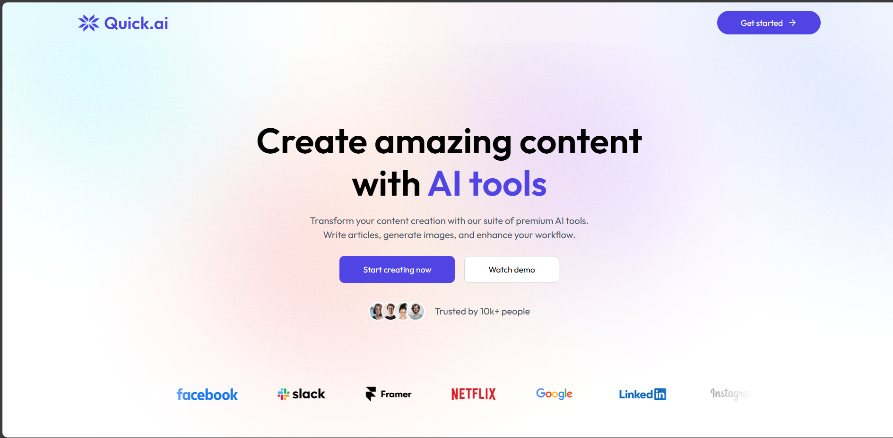

## QuickAI-Full-Stack Screenshots

⚡ AI SaaS PERN – Build, Launch & Scale with AI Tools

Welcome to the future of AI SaaS! 🚀 This project is a full‑stack subscription‑based AI platform built with the PERN stack — PostgreSQL (Neon), Express, React, and Node.js — and powered by Clerk authentication, Stripe billing, and a suite of cutting‑edge AI utilities.

✨ What Makes This Project Unique?

✅ Plug‑and‑Play AI Layer – Swap AI providers (OpenAI, OpenRouter, Replicate, Pollinations) with a simple adapter.

✅ Dual‑Tier Subscription Model – Free credits for new users, Stripe billing for premium unlimited access.

✅ Full‑Fledged Image Tools – Not just generation, but background removal, object erasing, and more.

✅ Resume Analyzer with Insights – Upload your CV and get actionable suggestions to improve it.

✅ Modern UI Kit – Clean, animated UI powered by Tailwind, shadcn/ui, and Framer Motion.

✅ Serverless First – Neon Postgres + deploy anywhere (Render, Railway, Fly.io, Vercel).

🔑 Core Features

🔐 Authentication – Clerk for secure login, profile, and orgs

💳 Billing – Stripe for checkout, billing portal, and subscription lifecycle

🗄 Database – Neon Postgres with Prisma/Drizzle ORM

🖊 AI Tools:

Article Generator (title + length)

Blog Title Generator (keyword + category)

Image Generator (prompt → image)

Background Remover (upload → transparent PNG)

Object Remover (upload + specify object)

Resume Analyzer (upload CV → analysis)

📊 Usage Tracking & Quotas – Free vs premium limits

🌐 Responsive Web UI – Mobile‑first, beautiful animations, dark mode ready

🧭 Demo Walkthrough

Sign up with Clerk (email, Google, or OTP).

Try AI features with free trial credits.

Upgrade with Stripe Checkout → get premium instantly.

Enjoy unlimited AI power: generate, edit images, analyze resumes.

Manage subscription anytime via Stripe Billing Portal.

🏗 Tech Stack

Frontend: React (Vite), TailwindCSS, shadcn/ui, Framer Motion

Backend: Node.js, Express, Clerk middleware, Zod

Database: PostgreSQL (Neon)

Billing: Stripe API + Webhooks

AI Providers: OpenAI, Replicate, Remove.bg (pluggable)

Deploy: Vercel (client), Render/Railway (server)

⚙️ Quick Start
# Clone repo
git clone https://github.com/yourname/ai-saas-pern.git
cd ai-saas-pern

# Install deps
cd apps/client && npm install
cd ../server && npm install

# Run dev servers
npm run dev # in both client & server

Then open:

Frontend → http://localhost:5173

API → http://localhost:8080

🛠 Example API Routes
POST /ai/article          { title, length }
POST /ai/blog-titles      { keyword, category }
POST /ai/image            { prompt }
POST /ai/image/bg-remove  file upload
POST /ai/image/object-remove file + object name
POST /ai/resume/analyze   resume upload

🚀 Roadmap

🤝 Contribute

PRs and feature requests are welcome! 💡 Open an issue to discuss what you’d like to see.

📜 License

MIT © 2025 – Crafted with ❤️ by Abhishek Pradhan
